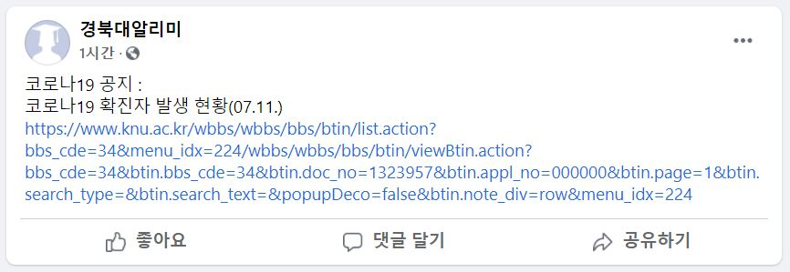
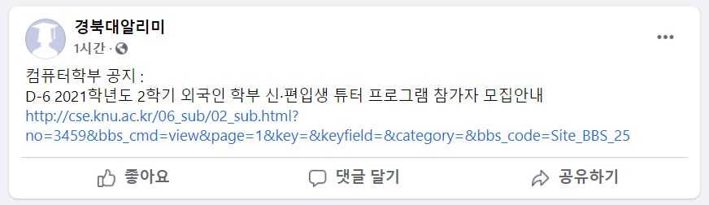

# KNU_SW_Hackathon
## 경북대 알리미 - 조이, 최명빈
### 1. 경북대 알리미에 대하여
#### 1.1 경북대 알리미란?

---
[경북대 알리미](https://www.facebook.com/%EA%B2%BD%EB%B6%81%EB%8C%80%EC%95%8C%EB%A6%AC%EB%AF%B8-105561965149637/news_feed)
는 코로나19로 인한 학교 내의 확진자 발생 현황이나 경북대 컴퓨터학부 사이트 내 공지사항을 가장 빠르게 알 수 있는 페이스북 페이지입니다. 

#### 1.2 제작 배경

---
현재 우리는 코로나19로 인해 주변의 확진자가 어느 곳을 방문했는지 문자를 통해 바로 알림을 받아볼 수 있습니다. 그러나 
**경북대 내에서의 확진 현황이나 검사 현황**과 같은 정보는 직접 공지사항을 찾아보지 않는 한 알기 힘든 실정입니다. 
또한 평소 많은 컴퓨터학부 학생들이 학부 공지사항을 직접 드나들면서 학부의 정보를 파악해야 해서 번거로움을 느끼고 있습니다.
그래서 많은 학생들이 접근 가능한 페이스북 페이지를 만들어, 더 편리하게 학교 관련 정보를 얻을 수 있도록 하고자 이 페이지를 만들게 되었습니다.

### 2. 사용한 패키지

#### 2.1 웹페이지 크롤링

---
파이썬에서 urllib와 bs4 패키지를 사용해 출력하도록 했습니다.

#### 2.2 페이스북 업로드

---
페이스북 api와 파이썬 facebook-sdk 패키지를 사용해 업로드하였습니다.

### 3. 시연 모습

코로나19 관련 공지사항입니다.

컴퓨터학부 홈페이지 관련 공지사항입니다.
